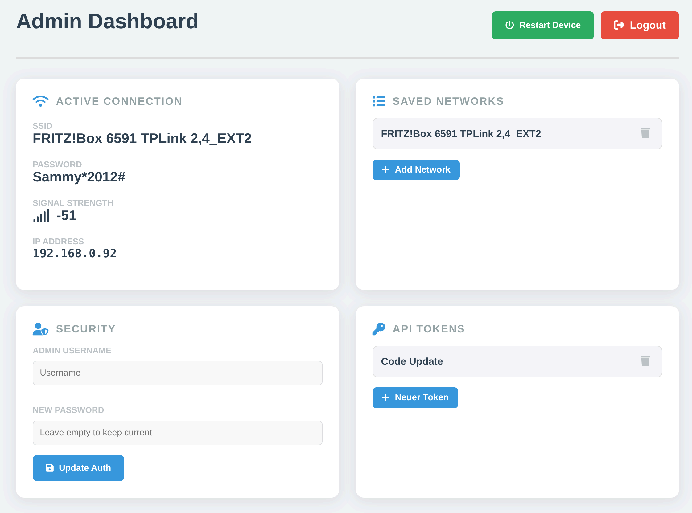

# 🚀 (Prototype) ESP32 Mini WebServer Framework

<div align="center">


### ⚠️ This is still a Prototype for my Personal Projects

### 🤓 So Please be nice with your Feedback

</div>


## 🎯 Overview

A lightweight **Mini WebServer Framework** for ESP32 microcontrollers, built as a personal project.

Add it to your PlatformIO project via `lib_deps` and include `MiniServer.h`.

May not work with the RISC V Processor
- ESP32-C3
- ESP32-C6
- ESP32-H2

It Should work with following families:
- ESP32 (WROOM, WROVER, CAM ...)
- ESP32-S2
- ESP32-S3

## 🙏 Acknowledgments

- 🎉 **Arduino Community** for the amazing ecosystem
- 🔧 **PlatformIO** for the excellent development platform
- 🌐 **ESP32** community for inspiration and support
- 💖 **Open Source** contributors worldwide


## 📁 Project Structure

```
📦 ESP32 Mini WebServer Framework
├── 📁 lib/
│   └── 📁 server/
│       ├── 🌐 MiniServer.h/.cpp         # Core web server
│       ├── 📁 router/
│       │   ├── 🛤️ router.h/.cpp        # Routing engine
│       │   ├── 📥 request.h/.cpp       # HTTP request handling
│       │   └── 📤 response.h/.cpp      # HTTP response handling
│       └── 📁 utils/
│           ├── 🔐 utility.admin.h/.cpp # Admin Dashboard
│           ├── 🛜 utility.wifi.h/.cpp  # WiFi utility
│           ├── 📂 utility.file.h/.cpp  # File utility
│           └── 🔄 utility.update.h/.cpp # OTA update utility
├── 📁 src/                             # Example application
│   ├── 🎯 main.cpp
│   └── 📁 routes/
│       └── 🛤️ routes.example.h/.cpp
├── 📁 data/
│   └── 📁 web/
│       ├── 🎨 index.html               # Example web interface
│       └── 🎨 main.css                 # Example styles
├── 📋 library.json                     # PlatformIO library config
├── ⚙️ platformio.ini                   # Build configuration
└── 📖 README.md                        # This file
```

## 📦 Installation

Add the following to your `platformio.ini`:

```ini
[env:your_board]
platform = espressif32
framework = arduino
board = <your-board>
board_build.filesystem = littlefs

lib_deps =
    https://github.com/LemurDaniel/ESP32__MiniWebServer-Framework.git

; List any static files you want embedded in the LittleFS image
board_build.include_files_txt =
    data/web/index.html
    data/web/main.css
```

---

## 🎮 Usage

### 🚀 Quick Start

#### Prerequisites

- ✅ [PlatformIO IDE](https://platformio.org/platformio-ide)
- ✅ ESP32 development board
- ✅ USB cable for programming
- ✅ WiFi network (optional — can be configured via AP mode after flashing)

#### Minimal example

```cpp
#include <Arduino.h>
#include <MiniServer.h>

void setup()
{
    Serial.begin(115200);

    ESP32WebServer::MiniServer *Server = new ESP32WebServer::MiniServer();

    // Optional: pre-save WiFi credentials in code.
    // Without this the device starts in AP mode — see WiFi Setup below.
    // Server->connectWiFi("YOUR_SSID", "YOUR_PASSWORD");

    // Optional: set a mDNS hostname — device becomes reachable as myESP32.local
    // Server->dns("myESP32");

    // Optional: serve static files from LittleFS (requires filesystem upload).
    // root() sets the base directory for static files; any request that matches
    // a file in that directory is served automatically.
    // index() defines the file returned for GET /.
    // Server->root("/web");
    // Server->index("/web/index.html");

    // Optional: Take care of CORS
    // Server->use(Server->cors());

    Server->get("/hello", [](ESP32WebServer::Request &req, ESP32WebServer::Response &res) {
        res.text("Hello from ESP32!").OK();
    });

    Server->start(80);
}

void loop() { delay(10); }
```

After uploading, open the serial monitor — the device prints its IP address once connected. Navigate to that address in your browser.

---

### 🛜 WiFi Setup

The device supports two WiFi modes that switch automatically:

**Station mode** — connects to a saved WiFi network on boot and prints the assigned IP to the serial monitor.

**AP mode** — fallback when no saved network is in range. The device creates a hotspot called `ESP32_MiniWebServer` at `192.168.4.1`. Open the Admin Dashboard at `/admin` to scan for networks, enter credentials, and save them.

#### Configuring WiFi in code

Credentials are saved permanently to LittleFS. Multiple networks can be stored — on each boot the device picks whichever saved network has the strongest signal:

```cpp
Server->connectWiFi("HOME_SSID", "HOME_PASSWORD");
Server->connectWiFi("OFFICE_SSID", "OFFICE_PASSWORD");

// Remove all saved networks and force AP mode
// Server->clearWiFi();
```

#### Connection routine

On `Server->start()` and every **30 seconds** while offline:

1. **Scan** for nearby networks and match against all saved networks.
2. **Sort** matches by signal strength.
3. **Connect** to each candidate in order (30-second timeout per attempt).
4. **Fallback to AP mode** if no saved network is reachable.

---

### 📡 mDNS

Instead of typing the device's IP address, assign a hostname and reach it via `<name>.local`:

```cpp
Server->dns("myESP32");
Server->start(80);
// → http://myESP32.local
```

mDNS requires the host to be on the same local network. It also works after WiFi reconnects automatically. Not available in AP mode.

> **Browser compatibility:** May not resolve with certain Web Browsers. Check `ping myESP32.local` via the terminal.

---

### 🔨 Build & Upload

> Upload the filesystem **before** the firmware — otherwise the firmware boots without the files it expects.

**1. Upload the filesystem** — only required when serving static files from LittleFS (e.g. a frontend). Skip if you are not using `Server->root()` or `Server->staticFile()`.


**2. Upload firmware and open the serial monitor**


---

<details>
<summary>🛤️ Router System</summary>

For larger projects, group related routes into their own `Router` class instead of registering everything inline on the server.

### 1. Create the header file

Declare handler functions and a `Router` class that registers them:

```cpp
#include <Arduino.h>
#include <WiFi.h>

#include <router/router.h>

namespace routes_example
{
    class Router : public ESP32WebServer::Router
    {
    public:
        Router()
        {
            route("GET", "/hello", get_hello);
            route("GET", "/status", get_status);
            route("GET", "/example", get_example);
            route("POST", "/data", post_data);
        }

    private:
        static void get_hello(ESP32WebServer::Request &req, ESP32WebServer::Response &res);
        static void get_status(ESP32WebServer::Request &req, ESP32WebServer::Response &res);
        static void get_example(ESP32WebServer::Request &req, ESP32WebServer::Response &res);
        static void post_data(ESP32WebServer::Request &req, ESP32WebServer::Response &res);
    };
}
```

### 2. Implement route handlers

In the `.cpp`, include the header and implement each function:

```cpp
#include <routes/routes.example.h>

namespace routes_example
{
    void Router::get_hello(ESP32WebServer::Request &req, ESP32WebServer::Response &res)
    {
        res.text("Hello, World!").status(200);
    }

    void Router::get_status(ESP32WebServer::Request &req, ESP32WebServer::Response &res)
    {
        JsonDocument status;

        status["device"] = "ESP32";
        status["firmware"] = "1.0.0";
        status["uptime"] = static_cast<double>(millis());
        status["free_heap"] = static_cast<double>(ESP.getFreeHeap());
        status["wifi_rssi"] = static_cast<double>(WiFi.RSSI());

        res.json(status).status(200);
    }

    void Router::get_example(ESP32WebServer::Request &req, ESP32WebServer::Response &res)
    {
        res.text("This is an example route!").status(200);
    }

    void Router::post_data(ESP32WebServer::Request &req, ESP32WebServer::Response &res)
    {
        JsonDocument response;
        response["message"] = "Data received successfully";
        response["timestamp"] = millis();
        res.json(response).status(201);
    }
}
```

### 3. Register with the server

```cpp
#include <Arduino.h>
#include <MiniServer.h>
#include <routes/routes.example.h>

void setup()
{
    ESP32WebServer::MiniServer *Server = new ESP32WebServer::MiniServer();

    // Server->connectWiFi("YOUR_SSID", "YOUR_PASSWORD");

    // Serve static files from LittleFS
    Server->root("/web");
    Server->index("/web/index.html");

    Server->registerRouter(routes_example::Router());

    Server->start(80);
}

void loop() { delay(10); }
```

### Best Practices

**Organize by functionality:**
```
src/routes/
├── routes.sensors.h/.cpp   # 🌡️ Temperature, humidity, pressure
├── routes.control.h/.cpp   # 💡 LED, relay, motor control
├── routes.system.h/.cpp    # 📊 System info, diagnostics
└── routes.auth.h/.cpp      # 🔐 Authentication & user management
```

**Naming convention:**
```cpp
// Namespace: routes_{functionality}
namespace routes_sensors { ... }

// Functions: {method}_{endpoint}
void get_temperature(Request &req, Response &res) { ... }
void post_led_control(Request &req, Response &res) { ... }
```

</details>

---

<details>
<summary>📤 Response Handling</summary>

A `Response` object is passed to every handler. The response is sent automatically after the last handler finishes, or as soon as `finalize()` is called.

### Response types

| Method | Content-Type | Example |
|--------|-------------|---------|
| `text(str)` | `text/plain` | `res.text("Hello").status(200)` |
| `json(doc)` | `application/json` | `res.json(doc).status(200)` |
| `html(str)` | `text/html` | `res.html("<h1>Hi</h1>").status(200)` |
| `file(path)` | `text/html`| `res.file("/web/index.html")` |
| `binaryFile(path)` | `application/octet-stream` | `res.binaryFile("/data.bin")` |

Call `.header("Content-Type", "<Content-Type>")` to change type yourself.

### Status shorthands

These set the status code and fill in a default body if none was set yet:

| Method | Status | Default body |
|--------|--------|-------------|
| `OK()` | 200 | `"OK"` |
| `NotFound()` | 404 | `"Not Found"` |
| `InternalServerError()` | 500 | `"Internal Server Error"` |

```cpp
res.json(doc).OK();              // 200, JSON body
res.text("Missing").NotFound();  // 404, custom text body
res.text("Created").status(201); // any status code
```

### Stopping the middleware chain

Call `finalize()` to prevent any further handlers from running — typically used in middleware:

```cpp
res.text("Unauthorized").status(401).finalize();
```

➡️ See **🔗 Middleware** below for full details.

</details>

---

<details>
<summary>📥 Request Body</summary>

The request body is accessed via `req.body` and is read lazily — nothing is read from the socket until you call one of the methods below.

| Method | Description |
|--------|-------------|
| `req.body.text()` | Read body as a `std::string` |
| `req.body.json()` | Parse body as JSON, returns `JsonDocument` |
| `req.body.file()` | Write body to a temp file on LittleFS, returns the file path |
| `req.body.chunks(buf, size)` | Read body in chunks into a buffer, returns bytes read |

`req.body.contentLength` and `req.body.contentType` are always available without triggering a read.

### JSON body

```cpp
Server->post("/data", [](ESP32WebServer::Request &req, ESP32WebServer::Response &res) {
    JsonDocument body = req.body.json();
    const char* name = body["name"];
    res.text(name).OK();
});
```

### Binary / streaming (e.g. OTA firmware)

```cpp
Server->post("/ota", [](ESP32WebServer::Request &req, ESP32WebServer::Response &res) {
    if (Update.begin(req.body.contentLength)) {
        uint8_t buf[1024];
        size_t n;
        while ((n = req.body.chunks(buf, sizeof(buf))) > 0)
            Update.write(buf, n);

        if (Update.end() && Update.isFinished())
            res.text("Update OK").OK();
        else
            res.text("Update failed").InternalServerError();
    }
});
```

</details>

---

<details>
<summary>🔍 URL Query Parameters</summary>

Query parameters from the URL (e.g. `/search?term=hello&page=2`) are parsed automatically and stored in `req.query` as a `std::map<std::string, std::string>`.

```cpp
Server->get("/search", [](ESP32WebServer::Request &req, ESP32WebServer::Response &res) {
    if (req.query.find("term") == req.query.end()) {
        res.text("Missing parameter: term").status(400);
        return;
    }
    std::string term = req.query["term"];
    res.text("Searching for: " + term).OK();
});
```

| Access | Description |
|--------|-------------|
| `req.query["key"]` | Value of a query parameter |
| `req.query.find("key") != req.query.end()` | Check if a parameter is present |

> Parameters are not decoded — percent-encoding (e.g. `%20`) is left as-is.

</details>

---

<details>
<summary>🔗 Middleware Chain</summary>

Middleware lets you chain multiple handler functions for a single route. Each handler runs in order. Calling `res.finalize()` stops the chain immediately — no further handlers run.

### How it works

Instead of a single handler, pass a list to `route()`:

```cpp
route("GET", "/secret", {
    authMiddleware,   // runs first — calls finalize() with 401 if not authorized
    get_secret        // only runs if authMiddleware did NOT finalize the response
});
```

The server iterates through all handlers and stops as soon as `response.finalized == true` ([server.cpp](lib/server/server.cpp#L96-L107)).

### Implementing middleware

A middleware handler has the same signature as a regular route handler:

```cpp
void authMiddleware(ESP32WebServer::Request &req, ESP32WebServer::Response &res)
{
    if (req.cookies.find("session") == req.cookies.end())
    {
        res.text("Unauthorized").status(401).finalize();
        // Chain stops here — get_secret is never called
        return;
    }
    // No finalize() call → next handler in the chain runs
}

void get_secret(ESP32WebServer::Request &req, ESP32WebServer::Response &res)
{
    res.text("Secret data!").status(200);
}
```

### Registering middleware

**Per-route** — pass a handler list directly to `route()`. Runs only for that specific route:

```cpp
route("GET", "/secret",  { authMiddleware, get_secret  });
route("POST", "/config", { authMiddleware, post_config });
```

**Global / prefix-based** — register via `use()`. Runs before every route whose path starts with the given prefix. Useful for logging, CORS headers, or auth that spans multiple endpoints:

```cpp
class Router : public ESP32WebServer::Router
{
public:
    Router()
    {
        // Runs before every route
        use("/", loggingMiddleware);

        // Runs before every route under /api
        use("/api", authMiddleware);

        route("GET", "/hello",      get_hello);
        route("GET", "/api/data",   get_data);
        route("POST", "/api/config", post_config);
    }
};
```

### Execution flow

```
Request → use() handlers (in registration order, prefix-matched)
              │
              ├─ finalize() called → Response sent immediately
              │
              └─ not finalized ──→ per-route handler chain
                                        │
                                        ├─ finalize() called → Response sent
                                        │
                                        └─ not finalized ──→ final handler → Response sent
```

### Common middleware patterns

| Pattern | Where | Description |
|---------|-------|-------------|
| Logging | `use("/")` | Log every request without repeating per route |
| CORS headers | `use("/")` | Add headers to every response |
| Auth (global) | `use("/api")` | Protect all `/api/*` routes at once |
| Auth (per-route) | `route()` chain | Fine-grained control per endpoint |
| Rate limiting | `use("/")` | Track request counts, abort with `429` |

#### CORS

The server ships a built-in CORS handler. Register it once to add the appropriate headers to every response:

```cpp
// Allow all origins (default)
Server->use(Server->cors());

// Restrict to a specific origin
Server->use(Server->cors("https://my-frontend.example.com"));
```

➡️ See also: **📤 Response Handling** above for all available response methods.

</details>

---

<details>
<summary>🛜 Admin Dashboard</summary>

The built-in Admin Dashboard is available at `/admin` on every device. In AP mode (no WiFi configured) connect to the `ESP32_MiniWebServer` hotspot and open `192.168.4.1/admin`.



It provides:

- **WiFi** — scan for nearby networks, select one, enter the password and save. Credentials persist across reboots. Multiple networks can be stored; the device always picks the strongest signal.
- **Security** — change the admin username and password.
- **API Tokens** — create and manage permanent API tokens for programmatic access.
- **Restart** — reboot the device directly from the browser.


#### Default credentials

| Field | Default |
|-------|---------|
| Username | `admin` |
| Password | `admin` |

Override in code before calling `start()`:

```cpp
Server->defaultAdminCredentials("admin", "my-secure-password");
Server->defaultAdminSalt("optional-salt");

// Disable the admin dashboard UI (keeps the /admin API routes)
Server->disableAdminDashboard();

// Disable the admin dashboard and all /admin routes entirely
Server->disableAdmin();
```

#### Permanent API Tokens

Permanent tokens can be created from the **API Tokens** section of the admin dashboard. Unlike session tokens (which expire after 1 hour), permanent tokens persist across reboots and never expire.

Use them in API requests via the `Authorization` header:

```http
GET /admin/wifi/active HTTP/1.1
Authorization: <your-token>
```

Tokens are stored in `/admin_perm_token.json` on LittleFS.

</details>

---